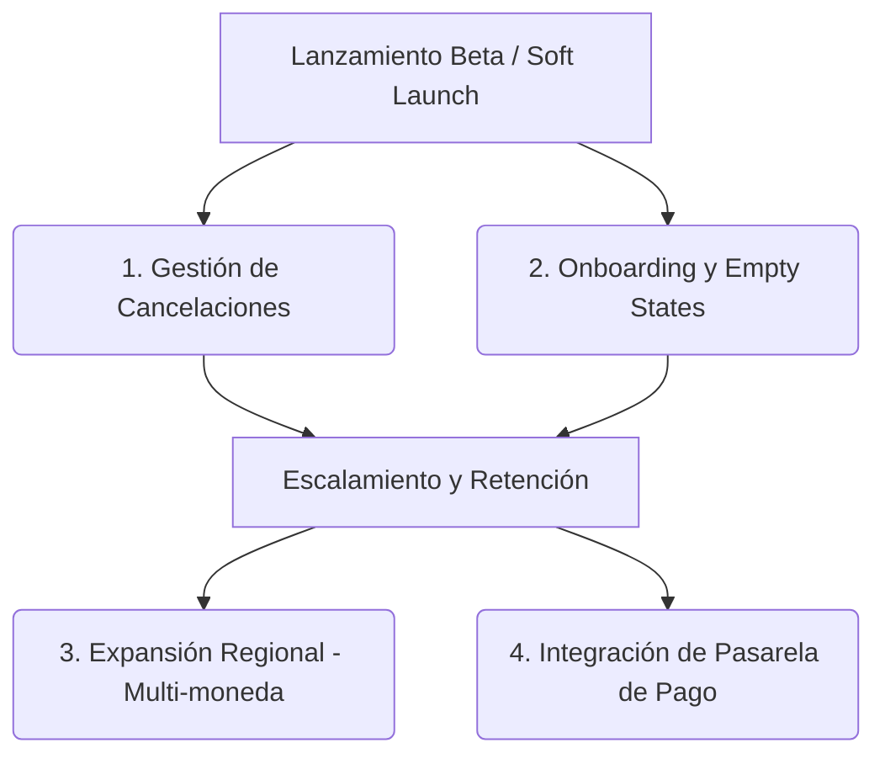

# Análisis de Preparación para el Mercado: Trazos

## 🚀 Veredicto: ¿Está lista para salir?
**Sí, para un Soft Launch (Lanzamiento Inicial en Argentina).**

Trazos superó la etapa de "idea" o "MVP básico" y cuenta con una arquitectura robusta (Next.js + Supabase + Gemini) y una propuesta de valor imbatible: **unificar la agenda, las finanzas y el soporte pedagógico en una sola herramienta sin fricción.** La reciente apertura hacia todos los perfiles de docentes particulares (secundaria, universitarios, psicopedagogos) multiplicó diez veces su mercado potencial.

---

## 🌟 Lo que ya tenés (Tus ventajas competitivas)

1. **Flujo de Cierre de Clase Híbrido:** La combinación del *Cierre Rápido Express* (1 clic para finanzas) con el *Cierre Pedagógico con IA* le da al docente el control total de su tiempo según la prisa que tenga.
2. **El Asistente "Tiza":** No es un chatbot genérico; está conectado a las herramientas de base de datos. Que un docente pueda decirle *"armame el mensaje de cobro para el papá de Santi"* y Tiza le arme el desglose exacto de clases adeudadas para mandar por WhatsApp es un efecto **"WOW"** instantáneo.
3. **Reportes Premium para Padres:** Es una herramienta de monetización clarísima. Los padres valoran enormemente recibir un informe profesional mensual del avance de sus hijos.
4. **Seguridad y Privacidad:** Al tener políticas estrictas de RLS (Row Level Security) y no enviar datos sensibles de alumnos a los modelos de IA, tenés un argumento de venta clave de confianza y tranquilidad.

---

## 🔍 Qué le falta (Oportunidades y Roadmap inmediato)

Para que el producto escale de los primeros 100 usuarios a miles, hay algunas áreas clave que deberías contemplar en las próximas iteraciones:

### 1. Gestión de Cancelaciones e Inasistencias (El día a día del particular)
En el mundo de las clases particulares, las cancelaciones sobre la hora son extremadamente frecuentes (*"Santi está con fiebre, te aviso ahora"*). 
* **Faltante actual:** En la agenda, vendría muy bien poder marcar una clase no solo como "Dictada" o "Cerrada", sino como **"Cancelada (Con aviso / Sin aviso)"**.
* **Impacto financiero:** Saber si esa clase cancelada se le cobra igual a la familia o se reprograma es vital para que al docente le cuadre el saldo a fin de mes.

### 2. Onboarding y "Empty States" (La primera impresión)
Cuando un usuario nuevo se registra y entra al Dashboard por primera vez, las tablas de agenda, finanzas y alumnos están vacías.
* **Recomendación:** Agregar un flujo de bienvenida de 1 minuto (*"¡Bienvenido a Trazos! Creemos tu primer alumno y agendemos tu primera clase"*). Un usuario guiado en los primeros 3 minutos tiene un 80% más de probabilidades de retención.

### 3. Expansión Regional y Configuración de Moneda
Hoy Trazos está muy optimizada para Argentina (español rioplatense, símbolos `$`, consulta de feriados oficiales de Argentina).
* **Oportunidad:** Dado que en toda Latinoamérica y España existe exactamente el mismo problema con las clases particulares, permitir en el perfil elegir el país (para adaptar la moneda USD/EUR/COP/MXN y los feriados locales) abriría las puertas a un mercado internacional gigante.

### 4. Automatización de Cobros (Roadmap Premium)
Hoy Tiza te prepara el texto para mandar por WhatsApp.
* **Siguiente nivel:** Integrar un link de pago directo (ej. MercadoPago / Stripe) dentro de ese mensaje de WhatsApp para que el padre toque y pague, y el sistema en Trazos se marque como "Pagado" automáticamente vía webhook.

### 5. Exportación de Datos (Tranquilidad del usuario)
* **Recomendación:** Agregar un botón simple en Finanzas y Alumnos de *"Exportar a Excel / CSV"*. Saber que sus datos no están "secuestrados" en la nube le quita al profesional el miedo a digitalizarse.

---

## 📋 Plan de Acción Recomendado para el Lanzamiento

1. **Lanzamiento Beta Gratuito (2-4 semanas):** Salí al mercado ofreciendo todas las funciones (incluso los reportes Premium) gratis durante el primer mes para captar a tus primeros 50-100 docentes activos.
2. **Bucle de Feedback:** Poné especial atención a los mensajes que lleguen al mail de sugerencias de la landing page. Los primeros usuarios te van a decir exactamente qué materia o función les hace falta.
3. **Activación del Paywall:** Una vez validados los flujos con usuarios reales, activá los límites del plan gratuito y habilitá la suscripción Premium para los docentes de alto volumen.
