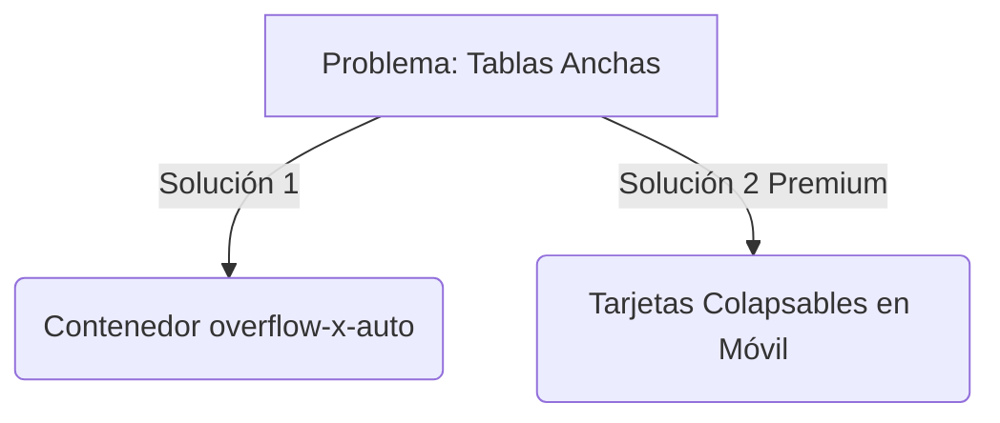

# Auditoría de Diseño y Experiencia de Usuario (UX/UI): Trazos

## 🎨 1. El Desafío Móvil: Tablas vs. Pantallas Chicas
La enorme mayoría de tus docentes particulares usarán Trazos desde su teléfono celular mientras están sentados con el alumno o en tránsito.

* **El Problema:** En pantallas como el Historial de Clases (`/clases`), Alumnos (`/alumnos`) y Cobranzas (`/finanzas/cobranzas`), la información está estructurada en tablas HTML estándar (`<table>`). En pantallas chicas (iPhone/Android), las tablas con muchas columnas (fecha, alumno, materia, estado, acciones) colapsan o se desbordan horizontalmente, rompiendo el maquetado.
* **La Solución:** 
  1. *Rápida:* Envolver todas las tablas en un contenedor `
`.
  2. *Premium:* Usar un patrón responsivo donde en escritorio (`md:table`) se ve la tabla, pero en móvil (`md:hidden`) cada fila se convierte en una **tarjeta compacta** (`
`).

---

## ⚡ 2. Feedback Inmediato e Indicadores de Carga (*Micro-Interacciones*)
Cuando una aplicación web tarda más de 300ms en responder sin dar señales visuales, el usuario siente que "se tildó" o hace doble clic.

* **El Problema:** En flujos clave como el filtrado por alumno o el envío de un formulario de nueva clase, la pantalla puede quedarse estática mientras Supabase o Gemini responden.
* **La Solución:** 
  * Reemplazar las esperas en blanco con **Skeleton Loaders** (barras con `animate-pulse-soft` y `bg-surface-200`) que simulen la estructura del contenido antes de que cargue.
  * En los botones de guardado o borrado, asegurar que siempre haya un estado `disabled` con un icono giratorio (`<Loader2 className="animate-spin" />`) y un texto claro (*"Guardando..."*, *"Generando con IA..."*).

---

## 🎯 3. Jerarquía Tipográfica y Contraste en Pastillas (*Badges*)
* **El Problema:** Al utilizar los colores de acento cálidos (ámbar y teal), a veces se generan combinaciones de bajo contraste (ej. texto blanco sobre fondo amarillo claro o texto gris sobre crema). Esto dificulta la lectura bajo el sol o para usuarios con vista cansada.
* **La Solución:** Asegurar que las pastillas de estado sigan una regla estricta de contraste:
  * **Éxito / Pagado:** Fondo verde muy claro (`bg-success-50`) con texto verde oscuro (`text-success-700`) y borde fino (`border-success-200`).
  * **Pendiente:** Fondo amarillo/ámbar claro (`bg-amber-50`) con texto marrón/ámbar oscuro (`text-amber-800`).
  * **Feriado / Cancelada:** Fondo rojo suave (`bg-danger-50`) con texto rojo intenso (`text-danger-700`).

---

## 🪟 4. Comportamiento de Ventanas Modales y Formularios Flotantes
* **El Problema:** En los modales (por ejemplo, al editar una clase o abrir el detalle de un cobro), en dispositivos móviles el teclado virtual al abrirse puede tapar el botón de "Guardar" o el input que el usuario está tocando. Además, si el usuario toca la zona gris fuera del modal, algunos modales no se cierran.
* **La Solución:** 
  * Implementar el cierre automático al presionar la tecla `Escape` o al hacer clic en el `backdrop` (fondo oscuro).
  * En móviles, anclar las acciones principales al fondo de la pantalla flotando sobre el teclado (`fixed bottom-0 left-0 right-0 p-4 bg-white shadow-lg z-50`).

---

## 🚀 Prioridades de Mejora Inmediata (Quick Wins)

| Pantalla | Defecto Actual | Mejora Propuesta |
| :--- | :--- | :--- |
| **Navegación Móvil** | Menú lateral (Sidebar) incómodo en celulares | Implementar una barra de navegación inferior (*Bottom Tab Bar*) con iconos grandes (Hoy, Agenda, Alumnos, Finanzas) para navegación a 1 mano. |
| **Formulario de Alumnos** | El selector de nivel educativo puede ser confuso | Mantener el *datalist* flexible pero añadir autocompletado inteligente visual tipo pastillas seleccionables rápidas. |
| **Finanzas** | Tarjetas de resumen muy estáticas | Añadir gráficos sencillos o barras de progreso visuales para ilustrar "Cobrado vs. Esperado". |
